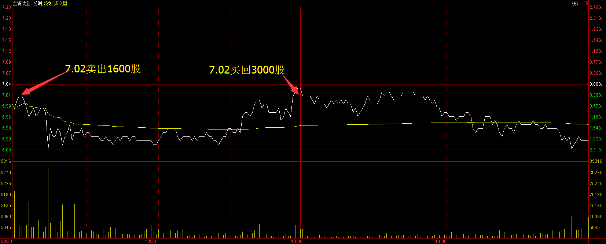
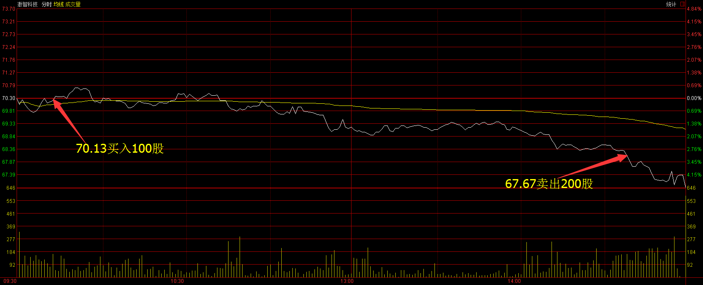
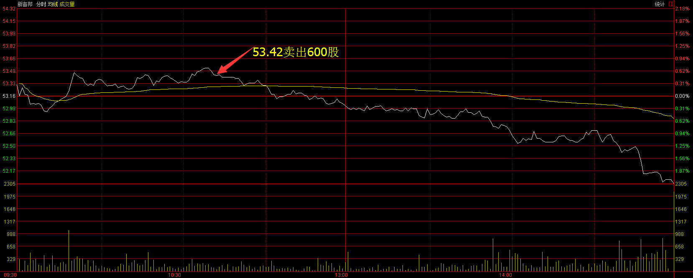
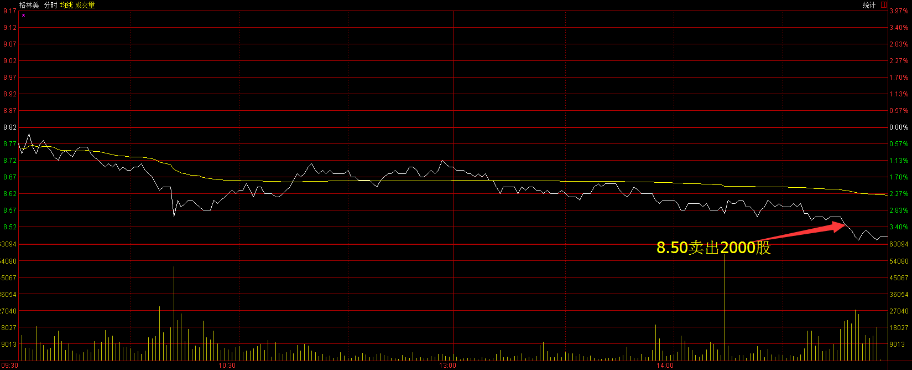
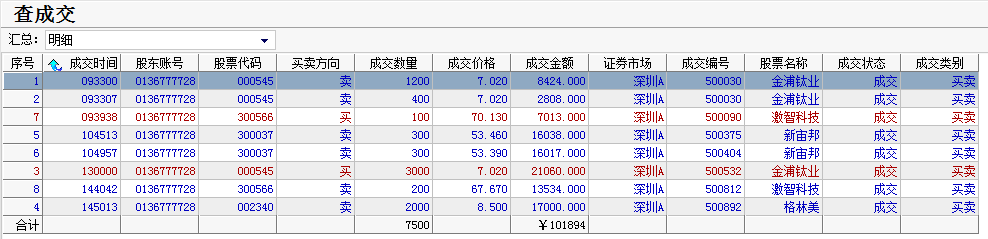
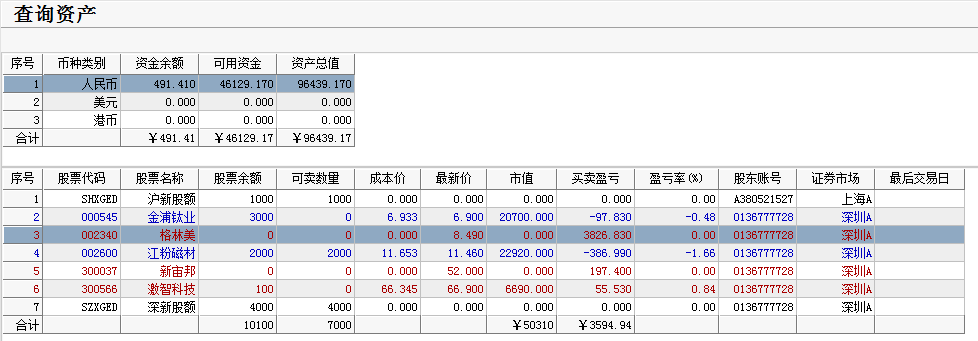

# 2017年3月17号交易计划 #
一、	大盘走势技术面分析：

- 今天沪指高开高走，收一根放量的光头中阳线，沪指收盘创3个月新高，从60分钟来看，沪指已经开始了第二波推动浪上涨，破前高3301的概率很大。创业板收一根光头的小阳线，成交量较昨日稍微放大，创业板权重股乐视网和网宿科技回调，影响了创业板指数，但个股活跃。从60分钟来看，创业板还在走收敛三角形整理，三角形整理一般都是中继形态，整理完毕，后市继续上涨概率较大。

二、	基本面分析：

1.	欧美股市涨跌不一。
2.	美国不会发动贸易战，支持美元长期走强。
3.	特朗普公布首份预算蓝图：国防开支将增540亿美元，政府开支大减。
4.	国务院印发《关于进一步激发社会领域投资活力的意见》，引导社会资本以政府和社会资本合作(PPP)模式参与医疗机构、养老服务机构、教育机构、文化设施、体育设施建设运营。可关注尚荣医疗(002551)。

三、	仓位管理
仓位保持在80%左右。

四、	今天操作计划：

- 早盘考虑卖出金浦钛业，买入激智科技，其他股份持仓观望，新宙邦冲高卖出，考虑买入新源材质或中颖电子。。

- 002340 格林美 持仓，留意日线顶分形的形成。
- 300566 激智科技 持仓，考虑加仓。
- 300037 新宙邦 冲高卖出。
- 000545 金浦钛业 早盘卖出。

>重点关注个股：300568星源材质； 002074国轩高科；000528柳工；000338潍柴动力；300340科恒股份；300073当升科技；002233塔牌集团。

# 2017.03.17交易总结 #
一、	当天走势技术分析回顾

- 今天沪指小幅高开，上午维持窄幅震荡的走势，昨日领涨的次新银行股、次新股、券商板块，今天变成了两市的领跌板块，下午两点之后开始逐波杀跌，回补昨天的跳空高开缺口，收出了阴包阳的形态，成交量放大，短期不太乐观，从60分钟来看，macd指标顶部背驰，短期沪指将展开调整或震荡，化解指标的顶背驰。

- 如果3月13号以来是第三浪推动浪上涨，那么这一波的推动浪的小1浪今天已经走完，小2浪调整正在进行中，在波浪理论里，2浪回调的位置是比较难预测的，2浪可以回调到1浪的起点高一个价位都是属于2浪，沪指刚创了前期新高就回调，有利于获利筹码的清洗，如果调整更为充分些，对沪指后市的继续展开小3浪上涨打下一个比较坚实的基础，短期的调整不改中期的上涨行情，耐心等待大盘的调整结束。

二、	交易明细

1.	买卖点截图

金浦钛业在7.02卖出1600股，在7.02买入3000股。

激智科技在70.13买入100股，在67.67卖出200股。

新宙邦在53.42卖出600股。

格林美在8.50卖出2000股。

2.	交易明细

三、	分析每笔交易心态、操作理由、可改进情况

交易总结：

- 今天卖出新宙邦和格林美，金浦钛业和激智科技做了T。

> 早盘次新股见顶的时候，新宙邦突破早盘震荡区间很快跌回来，卖出了新宙邦。

> 格林美60分钟MACD背驰，午后下跌没能拉回去，日线收了顶分形，收盘前卖出。

> 金浦钛业早盘冲高的时候卖出，卖出后金浦钛业下跌调整，临近中午收盘，金浦钛业站稳反弹，突破早上高点，在早盘高点买回来，后面大盘下跌，金浦钛业跟随大盘下跌。

> 激智科技早盘先下跌，在拉回到开盘价的时候买入，买入后一直震荡，午后破位下跌，没有及时止损，破了60分钟图前期盘整区间的时候卖出。

> 今天主要是对行情太乐观了，认为大阳线之后，最差的行情应该是震荡，没有想到后面会大跌，导致没有及时止盈。

四、	收盘后账户截图

