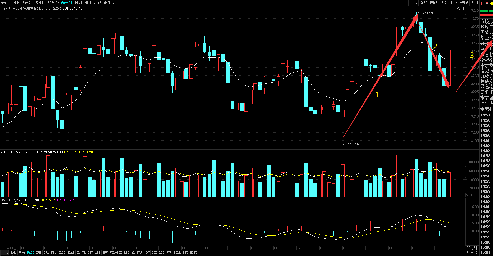
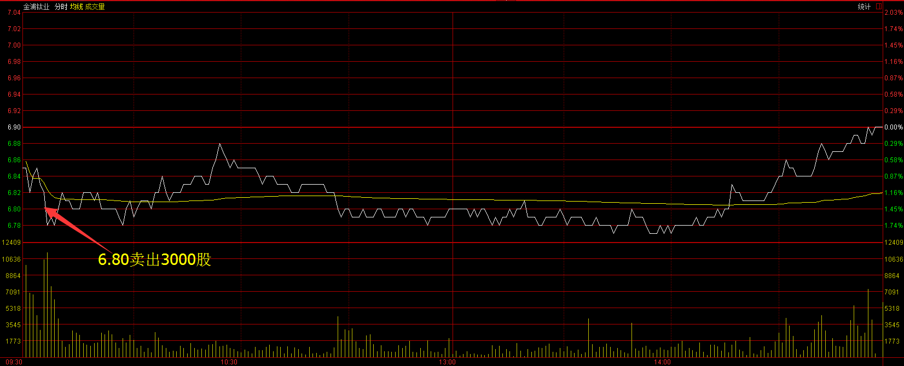
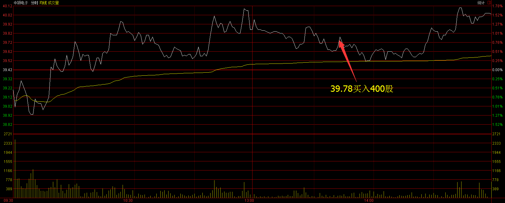
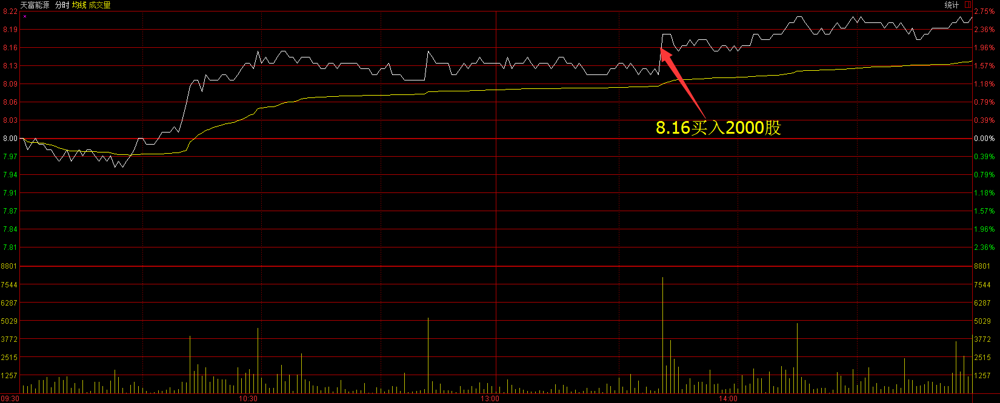
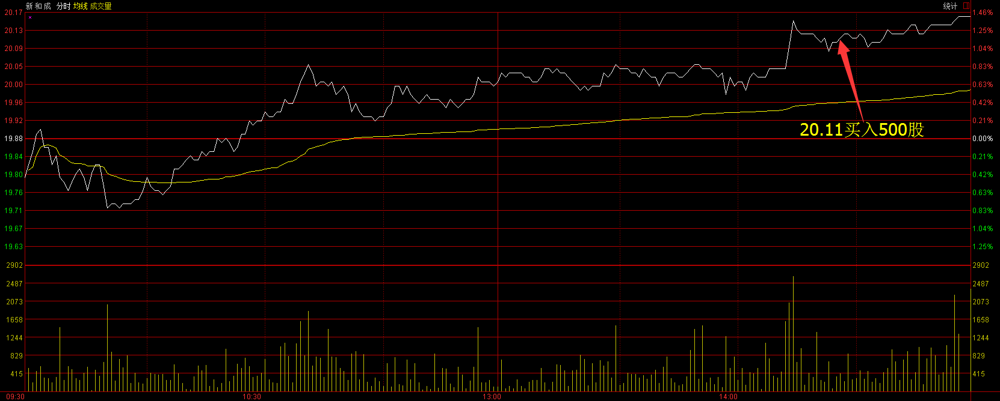
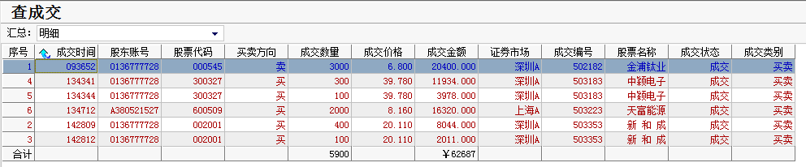
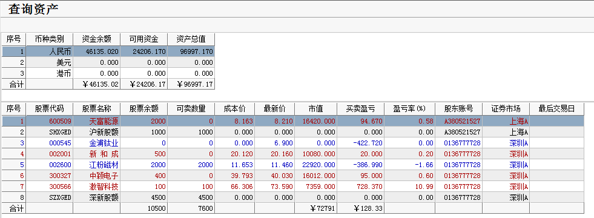

# 2017年3月20号交易计划 #
一、	大盘走势技术面分析：

- 今天沪指小幅高开，上午维持窄幅震荡的走势，昨日领涨的次新银行股、次新股、券商板块，今天变成了两市的领跌板块，下午两点之后开始逐波杀跌，回补昨天的跳空高开缺口，收出了阴包阳的形态，成交量放大，短期不太乐观，从60分钟来看，macd指标顶部背驰，短期沪指将展开调整或震荡，化解指标的顶背驰。

二、	基本面分析：

1.	欧美股市涨跌不一。

三、	仓位管理
仓位保持在70%左右。

四、	今天操作计划：

- 早盘考虑卖出金浦钛业，等大盘见底买入股票。

- 300566 激智科技 持仓观望。
- 300037 新宙邦 重点关注。
- 000545 金浦钛业 早盘卖出。
- 002340 格林美 重点关注。

>重点关注个股：300568星源材质； 002074国轩高科；000528柳工；000338潍柴动力；300340科恒股份；300073当升科技；002233塔牌集团。

# 2017.03.20交易总结 #
一、	当天走势技术分析回顾

- 今天沪指小幅高开，早盘整体震荡下行，午后刷新昨天的低点，形成5分钟MACD背驰，随后沪指强势反弹，收一根带下影线的光头小阳线。从60分钟来看，沪指尾盘在前期震荡区间站稳，收出了底分形，明天早盘应该还有上冲的动能，如果明天收在3258点之上，沪指调整可能结束。沪指从3月13号-3月17号为推动浪的1浪，今天沪指回调到1浪的0.5的位置附近站稳，2浪的调整有可能在这位置结束，短期沪指可能再继续震荡一下，消化上面的套牢盘，整理完毕，将展开3浪反弹。

- 次新股指数上周五放量下跌，今天缩量上涨，吃掉了前面一根阴线的大半，从30分钟来看，bbi指标已经创了新高，后市继续上涨的概率较大，次新股指数走势是大盘的先行指标之一，短期可关注次新股的走势。

二、	交易明细

1.	买卖点截图

金浦钛业在6.80卖出3000股。

中颖电子在39.78买入400股。

天富能源在8.16买入2000股。

新和成在20.11买入500股。

2.	交易明细

三、	分析每笔交易心态、操作理由、可改进情况

交易总结：

- 今天卖出了金浦钛业，午后买入了中颖电子、天富能源和新和成。

> 金浦钛业开盘跌破了昨天的低点，反弹乏力，卖出。

> 午后大盘见底，分别买入了中颖电子，天富能源和新和成。这三只股票都是日线在底部上方盘整，有突破上涨的趋势，它们在早上见底反弹，大盘下跌，它们没有跟随大盘下跌，而是盘整，相对比较强势，大盘背驰后，开始买入它们，它们后面上涨幅度也不大，主要是它们不是今天热点板块，资金最高意愿不强。

四、	收盘后账户截图

