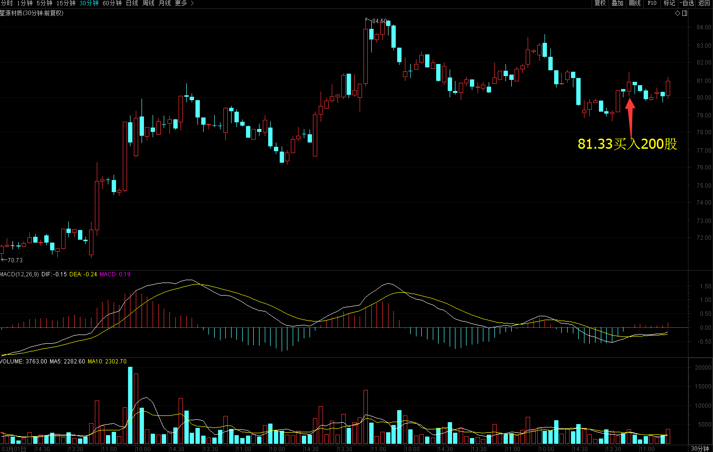
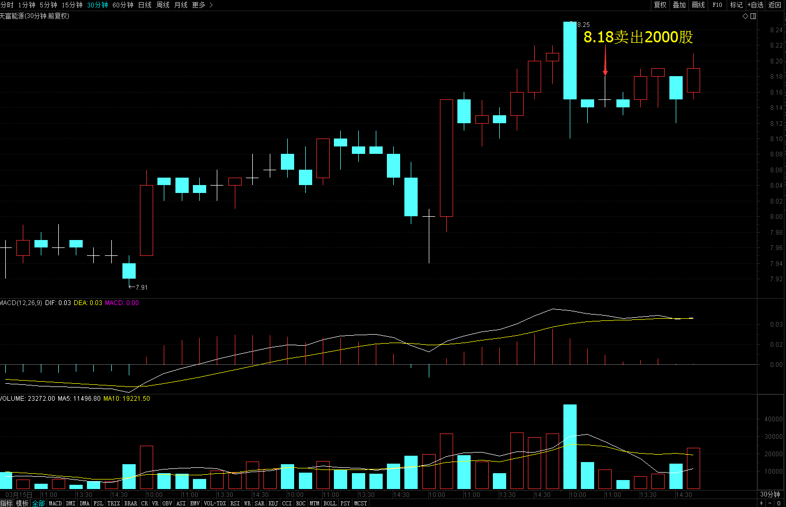
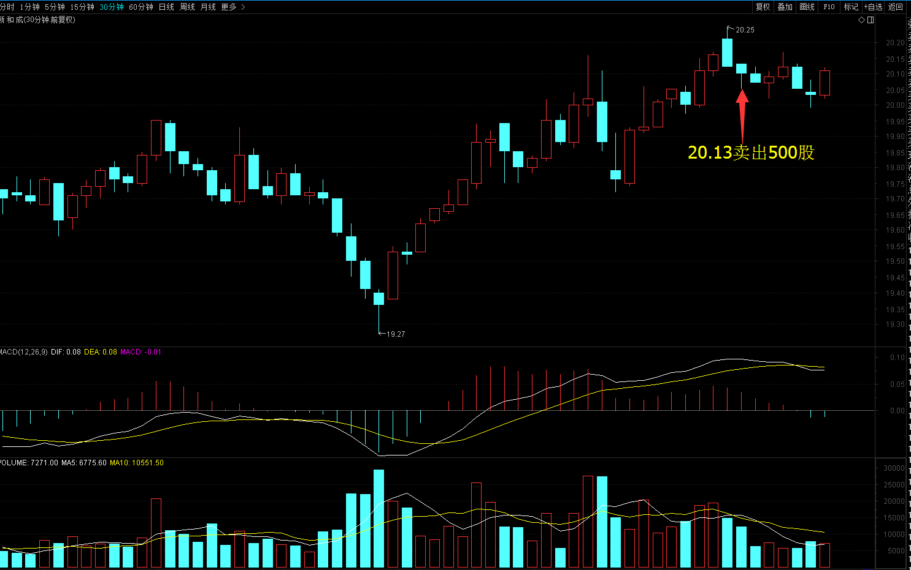
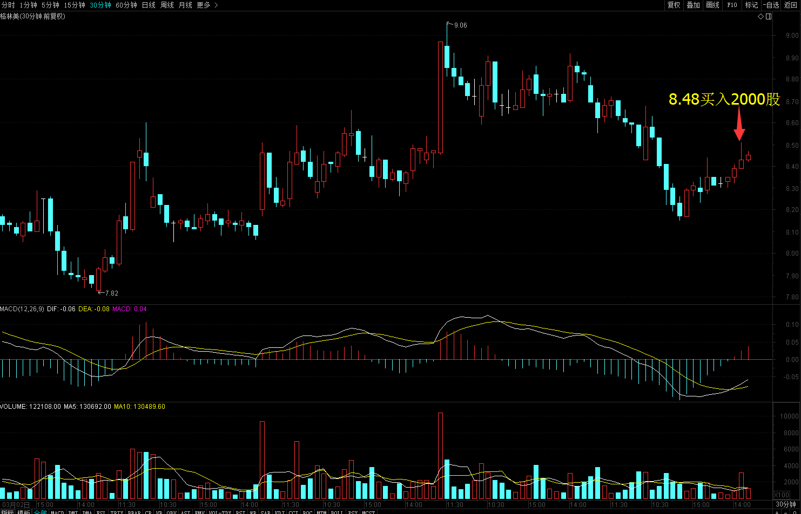
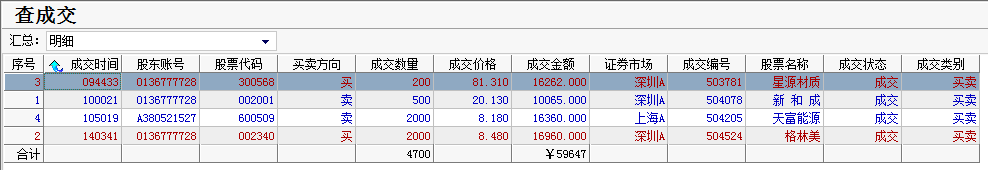
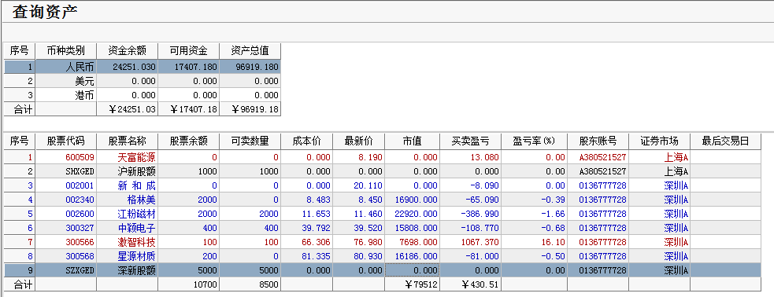

# 2017年3月21号交易计划 #
一、	大盘走势技术面分析：

- 今天沪指小幅高开，早盘整体震荡下行，午后刷新昨天的低点，形成5分钟MACD背驰，随后沪指强势反弹，收一根带下影线的光头小阳线。从60分钟来看，沪指尾盘在前期震荡区间站稳，收出了底分形，明天早盘应该还有上冲的动能，如果明天收在3258点之上，沪指调整可能结束。沪指从3月13号-3月17号为推动浪的1浪，今天沪指回调到1浪的0.5的位置附近站稳，2浪的调整有可能在这位置结束，短期沪指可能再继续震荡一下，消化上面的套牢盘，整理完毕，将展开3浪反弹。

- 次新股指数上周五放量下跌，今天缩量上涨，吃掉了前面一根阴线的大半，从30分钟来看，bbi指标已经创了新高，后市继续上涨的概率较大，次新股指数走势是大盘的先行指标之一，短期可关注次新股的走势。

二、	基本面分析：

1.	美银行股跌至一个月低位，美债涨，美元位于五周低点;
2.	英国启动退欧日子定了：3月29日③FBI局长首次证实：正对俄干预美总统大选调查;
3.	沙特领头OPEC欲重续减产协议，但非OPEC国家须配合;
4.	中日德呼吁自由贸易，美国眼里的“汇率操纵国”站在同一阵营;
5.	资金面出奇紧张：交易员“跪求”一天资金，仍有机构违约;
6.	美图、周黑鸭巨震，港“妖股”遭“黑色星期一”。

三、	仓位管理
仓位保持在70%左右。

四、	今天操作计划：

- 预计大盘震荡概率比较大，结合个股高抛低吸，逢低买入星源材质。
- 002340 格林美 调整结束买入。
- 300566 激智科技 持仓观望。
- 300037 新宙邦 重点关注。

>重点关注个股：300568星源材质； 002074国轩高科；000528柳工；000338潍柴动力；300340科恒股份；300073当升科技；002233塔牌集团。

# 2017.03.21交易总结 #
一、	当天走势技术分析回顾

- 今天沪指小幅低开，整体上震荡走高，收一根缩量的光头小阳线，收盘站上了3258点，继续向下的危险信号被消除，后市创近期新高的概率较大。目前大盘整体安全，短期可能会有反复，可以重个股，轻指数。

- 创业板收一根小阳线，收出底分形，形态来看，创业板还在小箱体里运行，预计短期将继续震荡，如果明天收在1966点，创业板向上突破箱顶概率较大。

二、	交易明细

1.	买卖点截图

星源材质在81.33卖出200股。

天富能源在8.18卖出2000股。

新和成在20.13卖出500股。

格林美在8.48买入2000股。

2.	交易明细

三、	分析每笔交易心态、操作理由、可改进情况

交易总结：

- 今天卖出了天富能源和新和成，买入了星源材质和格林美。

> 天富能源富能源和新和成都是高开低走，反弹乏力，冲高的时候卖出。这两只股票都活跃，不是近期主力资金青睐，打算卖出，大盘回落买入活跃板块的股票。

> 星源材质昨天尾盘5分钟图底背弛，今天上双底上方站稳，从60分钟图看，abc浪回调结束，早盘放量快速拉升买进。

> 午后大盘下跌，格林美日线在20天线站稳，逆市放量上涨，预期调整结束，买入了格林美。

四、	收盘后账户截图

