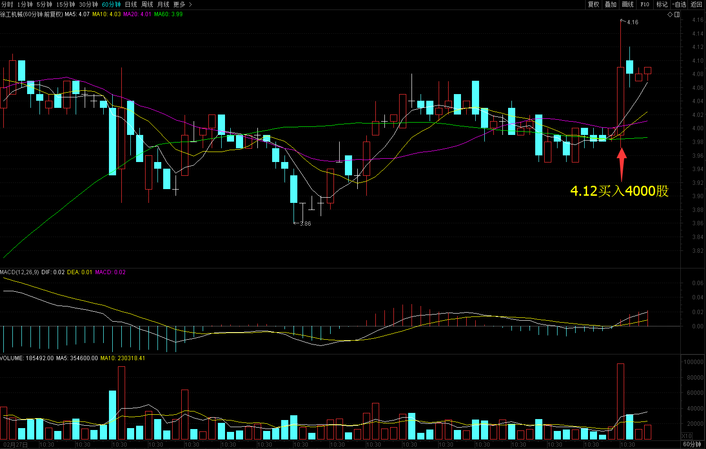
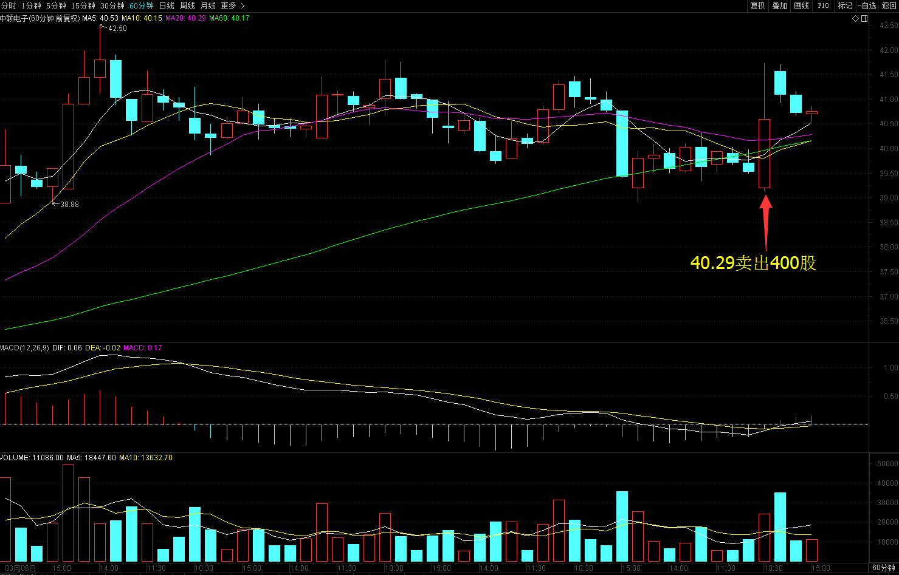
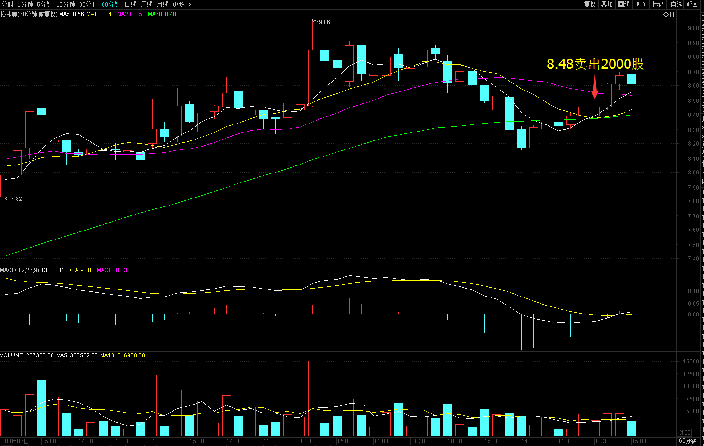
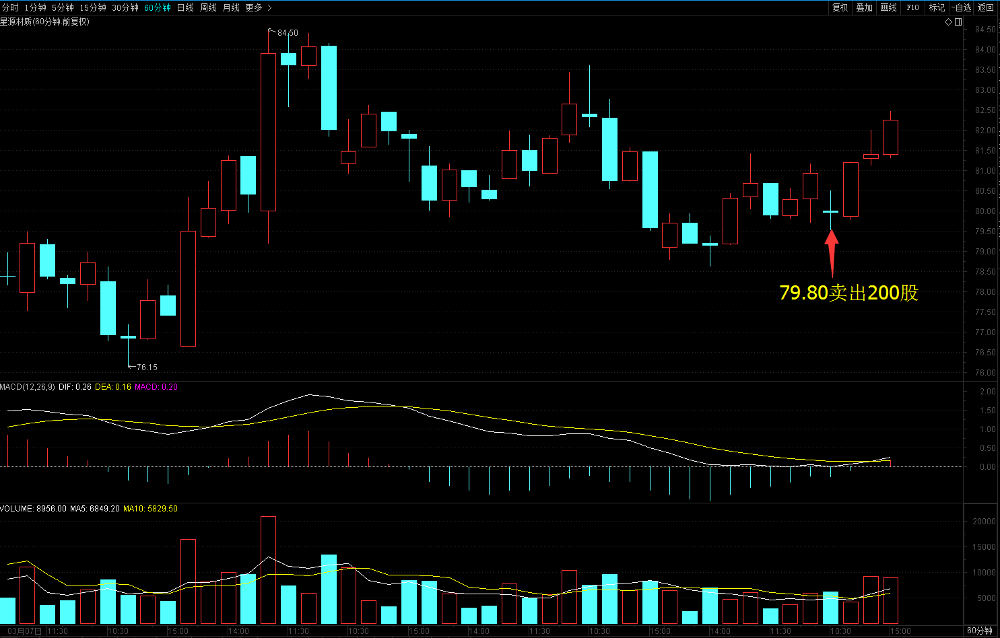
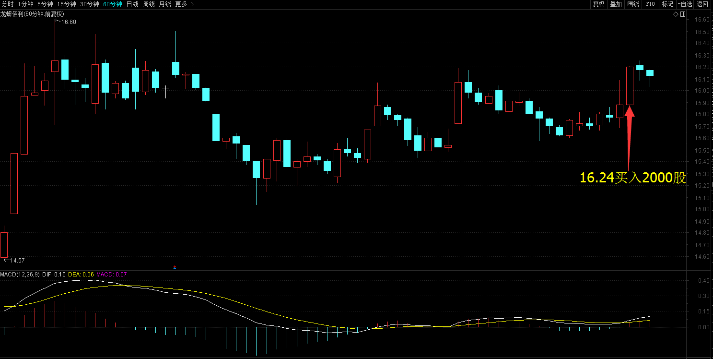
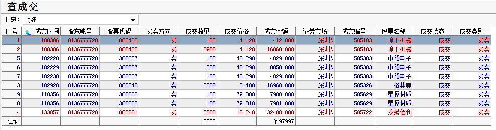
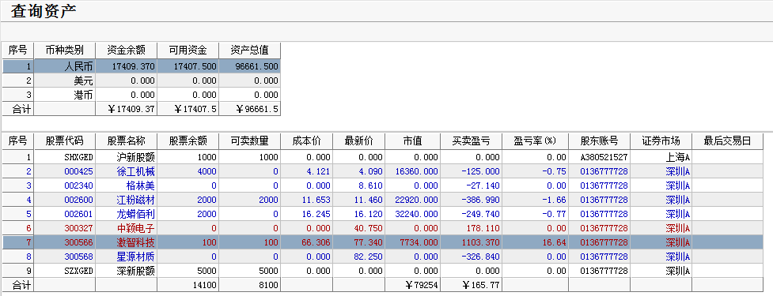

# 2017年3月22号交易计划 #
一、	大盘走势技术面分析：

- - 今天沪指小幅低开，整体上震荡走高，收一根缩量的光头小阳线，收盘站上了3258点，继续向下的危险信号被消除，后市创近期新高的概率较大。目前大盘整体安全，短期可能会有反复，可以重个股，轻指数。

二、	基本面分析：

1.“众院自由党团”或反对医改替代案，投资者担忧税改迟到，美股创年内最大日跌幅，美元跌。
2.贸易战初见端倪，特朗普或重审所有贸易协定。
3.苹果新品面世：红色iPhone7和史上最便宜的9.7英寸iPad。
4.央行紧急发文要求银行适度调整房贷，媒体称京首套房按揭利率升至95折
5.流动性紧张升级：1年期利率互换刷新两年新高，Shibor全线上涨。

三、	仓位管理
仓位保持在70%左右。

四、	今天操作计划：

- 预计大盘低开，开盘后会反弹，反弹乏力，结合个股卖出。
- 002340 格林美 反弹乏力卖出。
- 300568 星源材质 反弹乏力卖出
- 300327 中颖电子 反弹乏力卖出
- 300566 激智科技 持仓观望。
- 300037 新宙邦 重点关注。

>重点关注个股：002074国轩高科；000528柳工；000338潍柴动力；300340科恒股份；300073当升科技；002233塔牌集团。

# 2017.03.22交易总结 #
一、	当天走势技术分析回顾

- 受隔夜美股大跌的影响,沪指低开，随后小幅回升，尚未翻红便再度回落，午后维持震荡小幅反弹，收一根放量的星阴线，从60分钟图来看，3月17号以来维持三角形整理，目前三角形还没有走完，短期可以继续震荡整理。
- 创业板收一根放量的阴线，从60分钟来看，创业板维持在箱体的底部整理，BBI指标创箱体整理的新低，相对比较弱，如果明天跌破箱体的底部1939点，可能要下一个台阶，没有跌1939点之前，维持箱体震荡。

二、	交易明细

1.	买卖点截图

徐工机械在4.12买入4000股。

中颖电子在40.29卖出400股。

格林美在8.48卖出2000股。

星源材质在79.80卖出2000股。

龙蟒佰利在16.24买入2000股。

2.	交易明细

三、	分析每笔交易心态、操作理由、可改进情况

交易总结：

- 今天卖出了中颖电子，格林美和星源材质，买入徐工机械和龙蟒佰利。

> 早盘徐工机械放量上涨，突破震荡箱体的0.618位置买入。从日线来看，徐工机械维持三角形震荡整理，今天已经走完，放量突破，三角形一般都是中继形态。

> 大盘见顶的时候，中颖电子冲高二次确认顶部，卖出了中颖电子，卖出后后面还拉了一波，没能拿到，当时已经满仓了，大盘见顶，想把仓位减下来。

> 大盘创新低的时候，当时判断大盘可能大跌，分别卖出了格林美和星源材质，卖出后这两只股票都没有怎么跌，还是没能拿住股票，受大盘的影响太大了，学会拿住优质股票是一门重要的功课。

> 午后大盘二次确认底部的时候，龙蟒佰利放量上涨，买入了龙蟒佰利，龙蟒佰利也是维持箱体整理，突破0.618的位置。

四、	收盘后账户截图

