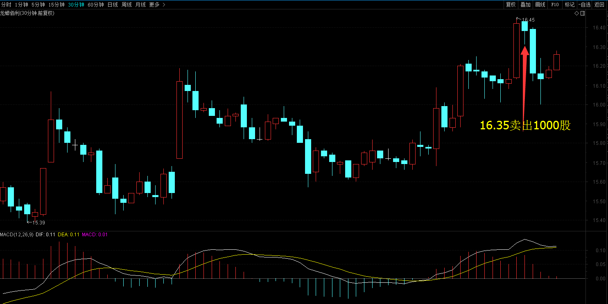
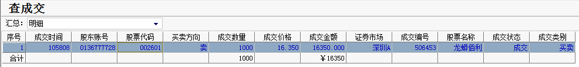
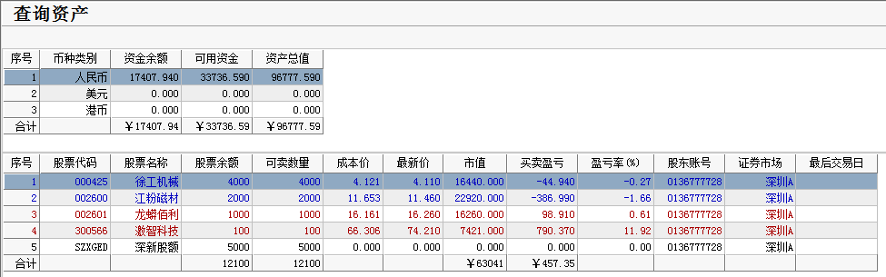

# 2017年3月23号交易计划 #
一、	大盘走势技术面分析：

- 受隔夜美股大跌的影响,沪指低开，随后小幅回升，尚未翻红便再度回落，午后维持震荡小幅反弹，收一根放量的星阴线，从60分钟图来看，3月17号以来维持三角形整理，目前三角形还没有走完，短期可以继续震荡整理。
- 创业板收一根放量的阴线，从60分钟来看，创业板维持在箱体的底部整理，BBI指标创箱体整理的新低，相对比较弱，如果明天跌破箱体的底部1939点，可能要下一个台阶，没有跌1939点之前，维持箱体震荡。

二、	基本面分析：

1. 市场等待医改投票，美股多上涨，美债黄金涨。
2. EIA原油库存大增近500万桶，美油盘中跌超2%。
3. 美众议员称目前还没足够的共和党众议员支持医改法案。
4. 腾讯四季度净利润同比增47%，《王者荣耀》日活过5千万。
5. 中证报：未来三个月内北京房价若继续“连创新高”，官方会考虑祭出新重拳。 
6. 国产大飞机C919首飞在即，万亿航空产业将崛起。
7. 全国各地区锐钛型钛白粉22日普涨450-500元每吨。
8. 2月铁路货运量同比增长19.4%，创下纪录新高。
9. 年1-2月，全国全社会用电量累计9356亿千瓦时，同比增长6.3%。其中2月份，全社会用电量4488亿千瓦时，同比增长17.2%。

三、	仓位管理
仓位保持在70%左右。

四、	今天操作计划：

- 预计大盘震荡，反弹高位，把仓位减下来，跌下来买回来。
- 002601 龙蟒佰利 冲高卖出一半的仓位。
- 000425 徐工机械 持仓 跌破3.97止损。
- 300566 激智科技 持仓观望。
- 600970 中材国际  重点关注
- 300037 新宙邦 重点关注。
- 300568 星源材质 重点关注。

>重点关注个股：002074国轩高科；000528柳工；000338潍柴动力；300340科恒股份；300073当升科技；002233塔牌集团。

# 2017.03.23交易总结 #
一、	当天走势技术分析回顾

- 今天沪指小幅高开，在保险、证券板块的带领下，沪指走高，午后，受B股大幅跳水的影响，沪指加速下跌，随后沪指探底回升，尾盘翻红，收一根稍微放量的星阳线，沪指接下来两个交易日的走势很关键，很可能结束盘整，走出明显的趋势的信号，如果沪指明天收盘站在3259点之上，后市将继续上涨，如果跌破3230点，可能要回到3200点附近起新的浪形。从60分钟图来看，3月17号以来的三角形调整已经走完，一般情况，三角形整理都是中继形态，认为后市向上突破的概率较大，随着今天午后恐慌盘的杀出，后市可能更容易拉升。

- 创业板收一根放量的星阴线，日线再次收于BBI之下，短线创业板指数形成反复震荡争夺的局面，从60分钟来看，创业板维持在箱体的底部运行，如果明天再次跌破箱体的底部1939点，很大概率要下一个台阶，没有跌1939点之前，维持箱体震荡。

二、	交易明细

1.	买卖点截图

龙蟒佰利在16.35卖出1000股。

2.	交易明细

三、	分析每笔交易心态、操作理由、可改进情况

交易总结：

- 今天上午大盘见顶的时候，龙蟒佰利在高位震荡，卖出了一半的龙蟒佰利，仓位太重了，把仓位减下来。

- 现在开始严格按照总结出的箱体理论交易系去操作，可能会面临系统性的风险，所以要根据大盘所处了位置和结构做好仓位管理。要避免大盘在相对低位，仓位太低，大盘开始上涨了，担心踏空的心理，导致追高买进股票。也要避免大盘在相对高位的时候，仓位太高，担心下跌的恐慌心理，导致乱卖出股票。做好仓位管理的情况下，要重个股，轻大盘。

四、	收盘后账户截图

