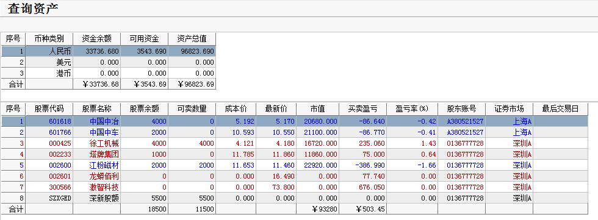

# 2017年3月24号交易计划 #
一、	大盘走势技术面分析：

- 今天沪指小幅高开，在保险、证券板块的带领下，沪指走高，午后，受B股大幅跳水的影响，沪指加速下跌，随后沪指探底回升，尾盘翻红，收一根稍微放量的星阳线，沪指接下来两个交易日的走势很关键，很可能结束盘整，走出明显的趋势的信号，如果沪指明天收盘站在3259点之上，后市将继续上涨，如果跌破3230点，可能要回到3200点附近起新的浪形。从60分钟图来看，3月17号以来的三角形调整已经走完，一般情况，三角形整理都是中继形态，认为后市向上突破的概率较大，随着今天午后恐慌盘的杀出，后市可能更容易拉升。

二、	基本面分析：

1. 美众议院推迟投票医改法案，道指创大选来最长连跌，恐慌指数年内新高。
2. 英国2月零售销售大超预期，英央行副行长称或加息。
3. 成都限购升级；广州住房信贷收紧，部分银行上调首套利率至95折。
4. MSCI提出新框架，A股6月被纳入概率明显提升。
5. 布局视频直播平台，腾讯领投快手3.5亿美元战略投资。
6. 海航集团一个月后再出手，增持德银股份升至第三大股东。

三、	仓位管理
仓位保持在70%左右。

四、	今天操作计划：

- 预计大盘震荡，反弹高位，把仓位减下来，跌下来买回来。
- 002601 龙蟒佰利 冲高卖出。
- 000425 徐工机械 持仓，跌破3.97止损。
- 300566 激智科技 早盘反弹乏力卖出。
- 600970 中材国际  重点关注
- 300037 新宙邦 重点关注。
- 300568 星源材质 重点关注。

>重点关注个股：002074国轩高科；000528柳工；000338潍柴动力；300340科恒股份；300073当升科技；002233塔牌集团。

# 2017.03.24交易总结 #
一、	当天走势技术分析回顾

- 今天沪指小幅低开，随后维持开盘价震荡，午后在中字头个股、一带一路板块的带动下，沪指放量强势上攻，刷新1月16号以来的新高，收一根放量的中阳线。沪指放量突破了三角形的上轨，BBI指标创了新高，有效突破概率很大。沪指3月17号以来的小2浪调整结束，后市将展开小3浪反弹，3浪不会是最短的一浪，后市突破前高3301的概率很大。

- 今天一带一路概念狂飙，中国建筑、中国中车、中国中冶等中字头权重股放量上涨，这些个股已盘整超过3个月，继续走强概率较大，这些个股权重股上涨对大盘影响很大，后市比较乐观。

二、	交易明细

1.	买卖点截图

塔牌集团在11.78买入1000股。

龙蟒佰利在16.26卖出1000股。

激智科技在73.19卖出100股。

中国中冶在5.19买入4000股。

中国中车在10.59买入2000股。

2.	交易明细

三、	分析每笔交易心态、操作理由、可改进情况

交易总结：

- 今天早盘卖出了龙蟒佰利和激智科技，买入了塔牌集团，中国中冶和中国中车。

> 塔牌集团日线在箱体里运行，昨天收了一根放量的大阳信号K线，今天早盘买进。

> 激智科技早盘30分钟收了一根大阴线，出现明显的头部结构，卖出平仓。

> 龙蟒佰利早盘冲高回落，大盘创了早盘的新低，预期会下跌一段，卖出了龙蟒佰利。

> 午后大盘见底上涨，突破了3262点，分别买入了中国中冶和中国中车，这两只个股的形态都是走完了收敛三角形，突破后放量上涨。都突破了小箱体的0.618位置。

四、	收盘后账户截图

