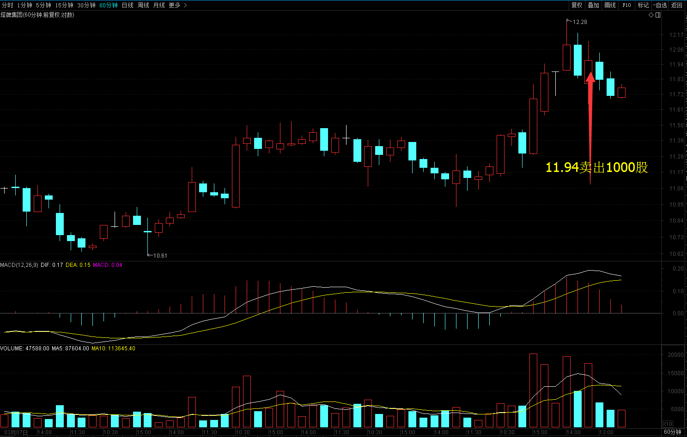

# 2017年3月27号交易计划 #
一、	大盘走势技术面分析：

- 受隔夜美股大跌的影响,沪指低开，随后小幅回升，尚未翻红便再度回落，午后维持震荡小幅反弹，收一根放量的星阴线，从60分钟图来看，3月17号以来维持三角形整理，目前三角形还没有走完，短期可以继续震荡整理。
- 创业板收一根放量的阴线，从60分钟来看，创业板维持在箱体的底部整理，BBI指标创箱体整理的新低，相对比较弱，如果明天跌破箱体的底部1939点，可能要下一个台阶，没有跌1939点之前，维持箱体震荡。

二、	基本面分析：

1.	欧美股市涨跌不一，道指连跌7日；金价上周五收高0.1%，全周累涨1.5%，连续第二周上涨。
2.	周小川回应宽松货币导致楼市泡沫：这不是预期后果，货币政策宽松已到周期尾部。
3.	张高丽称要抑制热点城市房价过快上涨。
4.	方星海称对A股今年纳入MSCI指数谨慎乐观，正研究将强制性环保信息披露推广到所有上市公司。
5.	证监会主席刘士余称，资本市场稳定是金融稳定的重要组成部分，证监会也将配合央行做好相应的金融稳定工作。

三、	仓位管理
仓位保持在80%左右。

四、	今天操作计划：

- 预计大盘震荡上涨，卖出塔牌集团，买入酒钢宏兴，冲高卖出股票。
- 002601 塔牌集团 冲高卖出。
- 000425 徐工机械 冲高卖出。
- 600307 酒钢宏兴 逢低买入。
- 601766 中国中车 持仓观望，止损10.27。
- 601766 中国中冶 持仓观望，止损5.01。

- 300037 新宙邦 重点关注。

>重点关注个股：002074国轩高科；000528柳工；000338潍柴动力；300340科恒股份；300073当升科技；002233塔牌集团。

# 2017.03.27交易总结 #
一、	当天走势技术分析回顾

- 沪指早盘放量上涨，缩量下跌，预示着市场的抛压不重，主要是由创业板的下跌带下来，创业板上周五缩量上涨，今天缩量跌回去，资金流入创业板的意愿不强，预期短期沪指还是以震荡为主，沪强深弱两市分化可能会继续。但如果明天沪指收盘跌破3262点，将是短期的卖出信号。

二、	交易明细

1.	买卖点截图

塔牌集团在11.94卖出1000股。

酒钢宏兴在3.30卖出4000股。

徐工机械在4.17卖出4000股。

2.	交易明细

三、	分析每笔交易心态、操作理由、可改进情况

交易总结：

- 今天卖出了塔牌集团和徐工机械，买入酒钢宏兴。

- 塔牌集团昨天没有创前期高点回落，形成二次确认，今天早上冲高回落的时候卖出。

- 酒钢宏兴周线是头肩底结构，突破颈线后回踩，在颈线上站稳，今天计划买入，卖出了塔牌集团，买入了酒钢宏兴。

- 徐工机械冲高回落，跌破开盘价的时候卖出，卖出有点晚。

四、	收盘后账户截图

