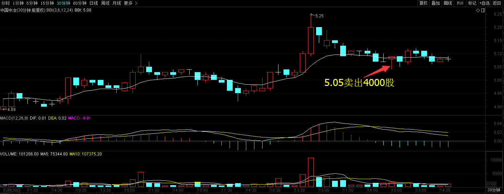
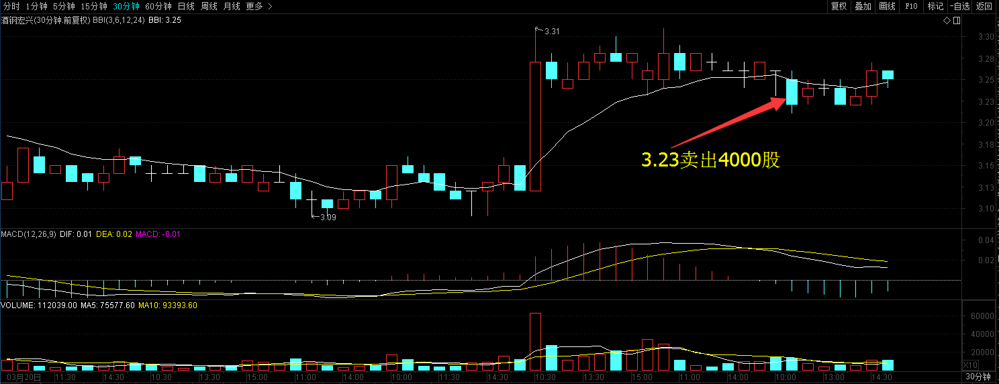
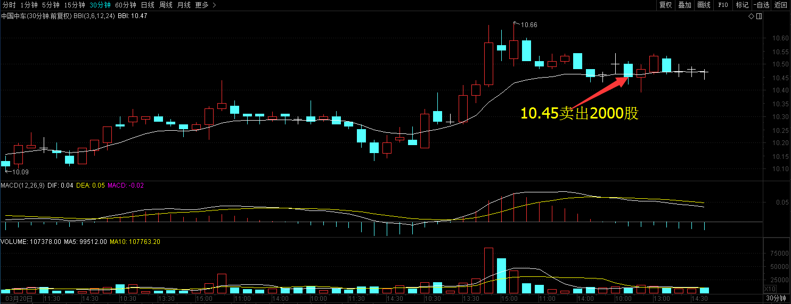
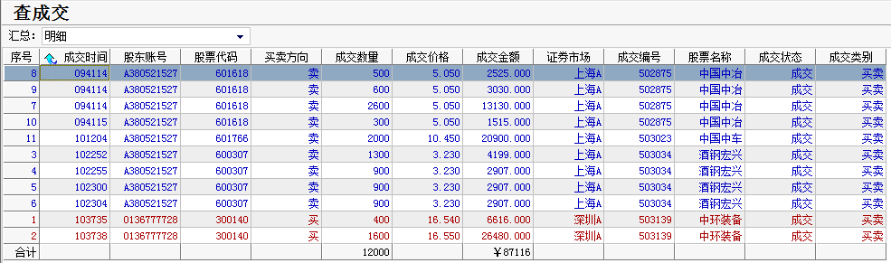
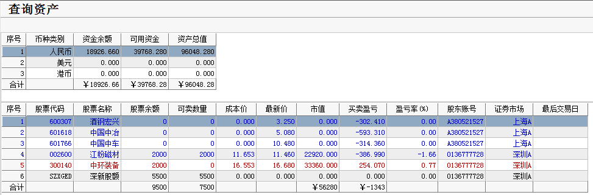

# 2017年3月28号交易计划 #
一、	大盘走势技术面分析：

- 沪指早盘放量上涨，缩量下跌，预示着市场的抛压不重，主要是由创业板的下跌带下来，创业板上周五缩量上涨，今天缩量跌回去，资金流入创业板的意愿不强，预期短期沪指还是以震荡为主，沪强深弱两市分化可能会继续。但如果明天沪指收盘跌破3262点，将是短期的卖出信号。

二、	基本面分析：

1.	美国三大股指涨跌不一，道指跌0.22%，连续8天收阴，创2011年以来最长连跌天数；纳指涨0.2%，标普跌0.1%。
2.	1-2月份，规模以上工业企业利润同比增长31.5%，增速较去年12月加快29.2个百分点，较去年全年加快23个百分点, 1-2月国有企业利润总额3018.6亿元，同比增长40.3%。
3.	交所行政总裁李小加称，MSCI明晟A股新方案向市场参与者征求意见，透露出对MSCI新兴市场指数纳入A股的漫长努力，可能找到某种折衷或过渡性解决对策。

三、	仓位管理
仓位保持在50%-70%左右。

四、	今天操作计划：

- 预计大盘震荡下跌，冲高卖出中国中冶，中国中车，酒钢宏兴，跌破3262，卖出股票，控制好仓位。

- 600307 酒钢宏兴 卖出。
- 601766 中国中车 卖出。
- 601766 中国中冶 卖出。
- 601100 恒立液压 重点关注
- 002340 格林美 重点关注。
- 002388 新亚制程 重点关注。
- 002300 太阳电缆 重点关注。
- 300099 尤洛卡 重点关注。

# 2017.03.28交易总结 #
一、	当天走势技术分析回顾

- 今天沪指低开，随后震荡下跌，午后，国债期货跳水，带动沪指继续下探，临近尾盘小幅回升，收一根缩量的阴线，日线收出了顶分形，K线形态上是黄昏之星，短期看空形态，从60分钟图来看，MACD指标顶部背驰，后市要么下跌要么盘整来化解MACD指标的顶部背驰，但今天的成交量萎缩，抛压并不强，预计短期将震荡调整。

- 季未是银行冲时点的时候，资金又开始紧张起来，沪指短期的形态也不太乐观，短期有调整的需求，但更多的是为冲3300点大关前蓄势，可能正是逢低进场的机会，下方有强支撑，大盘回调的幅度应该也会不太大，但上方有强压力，控制好仓位，高抛低吸也是不错的策略。

二、	交易明细

1.	买卖点截图

中国中冶在5.05卖出4000股。

酒钢宏兴在3.23卖出4000股。

中国中车在10.45卖出2000股。

中环装备在16.54买入2000股。

2.	交易明细

三、	分析每笔交易心态、操作理由、可改进情况

交易总结：

- 今天卖出了中国中冶、中国中车和酒钢宏兴，买入中环装备。

> 大盘低开，低开后跌破，计划大盘跌破3262点减仓，中国中冶跌破昨天低点的时候卖出。

> 创业板早盘低开高走，但很快创新低，大盘很弱，创了新低，预计今天大盘可能大跌，卖出了中国中车和酒钢宏兴。

> 中环装备60分钟图出现2类买点，从分时图看，股价在小箱体里震荡，放量突破，然后再维持超过30分钟的小箱体里震荡，再次放量突破箱体顶部的时候买进，买进的位置相对有些高，止损位置放在第二个箱体底部。

四、	收盘后账户截图

