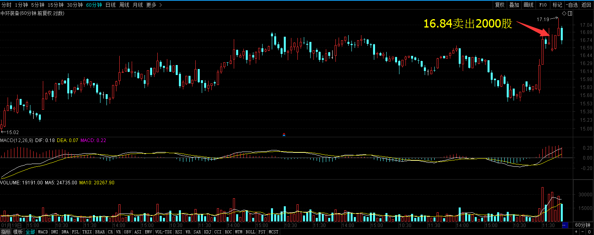
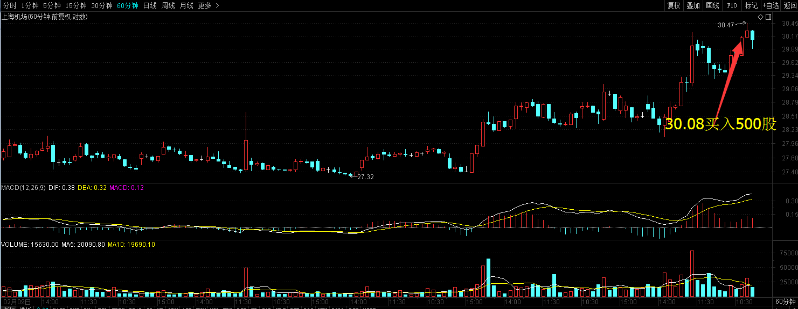
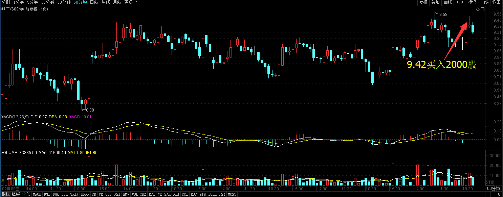
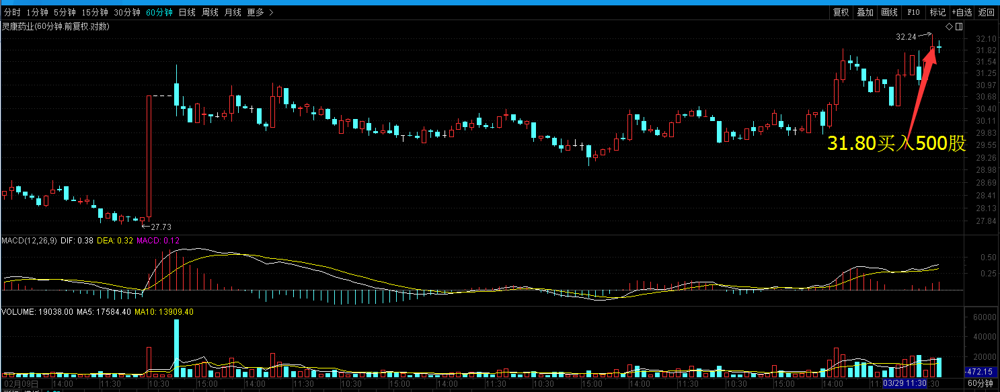
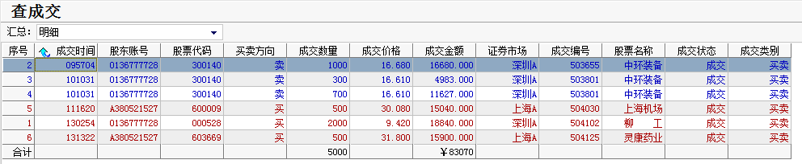
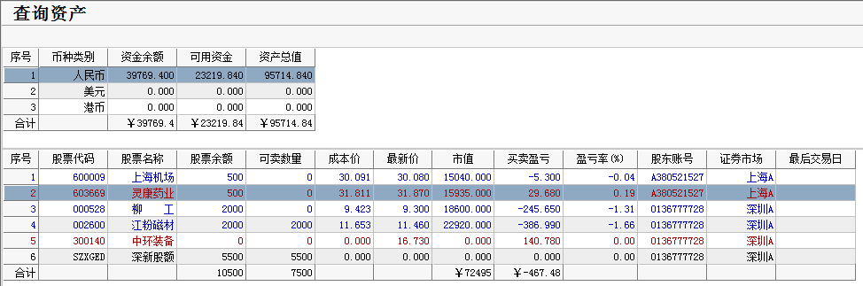

# 2017年3月29号交易计划 #
一、	大盘走势技术面分析：

- 季未是银行冲时点的时候，资金又开始紧张起来，沪指短期的形态也不太乐观，短期有调整的需求，但更多的是为冲3300点大关前蓄势，可能正是逢低进场的机会，下方有强支撑，大盘回调的幅度应该也会不太大，但上方有强压力，控制好仓位，高抛低吸也是不错的策略。

二、	基本面分析：

1.	特朗普放松煤炭行业监管，美股收高；受益于业绩强劲和并购前景看好，欧股反弹；美股与美元同步上扬，降低了市场对黄金的投资需求，金价微跌。
2.	3月27日BDI指数达到1282点，创出2014年11月以来最高点，较年内最低点685点，已上涨87%。主要是因为中国大宗商品进口量价齐升，推动BDI季节性反弹，但是此次BDI反弹较市场预期较早，上涨幅度也超出市场预期。
3.	腾讯入股特斯拉, 占股5%，成为第五大股东。
4.	国务院发布关于落实《政府工作报告》重点工作部门分工的意见，货币政策要保持稳健中性。加强房地产市场分类调控，房价上涨压力大的城市要合理增加住宅用地，遏制热点城市房价过快上涨。深化多层次资本市场改革，完善主板市场基础性制度，积极发展创业板、新三板，规范发展区域性股权市场。

三、	仓位管理
仓位保持在50%-70%左右。

四、	今天操作计划：

- 预计大盘震荡下跌，控制好仓位，高抛低吸。

- 300140 中环装备 冲高卖出。
- 601100 恒立液压 重点关注
- 002340 格林美 重点关注。
- 000528 柳工  重点关注。
- 002300 太阳电缆 重点关注。
- 300099 尤洛卡 重点关注。
- 603227 雪峰科技 重点关注。

# 2017.03.29交易总结 #
一、	当天走势技术分析回顾

- 创业板收盘已经跌破横盘超过3周的箱体，头部结构明显，短期继续调整概率较大。沪指收出了三只乌鸦K线形态，短期看空，明天关注3221点的支撑，跌破后可能会考验3200点的支撑。

二、	交易明细

1.	买卖点截图

中环装备在16.64卖出2000股。

上海机场在30.08买入500股。

柳工在9.42买入2000股。

灵康药业在31.80买入500股。

2.	交易明细

三、	分析每笔交易心态、操作理由、可改进情况

交易总结：

- 今天卖出了中环装备，买入了上海机场、柳工、灵康药业。

> 大盘早盘下跌的时候，中环装备冲高回落，卖出了中环装备，最近跟着大盘走，追涨杀跌，没有根据个股的特性做出决策，要学会重个股轻大盘，学会在大盘杀跌的时候持有优质个股。

> 大盘见底反弹上去的时候，买入了上海机场、柳工。这两只股票都是在小箱体整理超过30分钟，放量突破后上涨一段，然后维持小箱体整理，再放量突破的时候买进，这个交易系统的止损位置是第二次盘整箱体的底部位置，但会面临一个问题就是系统性风险，大盘下跌，个股跟着下跌，可能当天止损不了。

> 灵康药业日线突破箱体的时候买进，这个形态有点类似头肩底，形态不错，西藏板块也是近期的热点板块。

四、	收盘后账户截图

