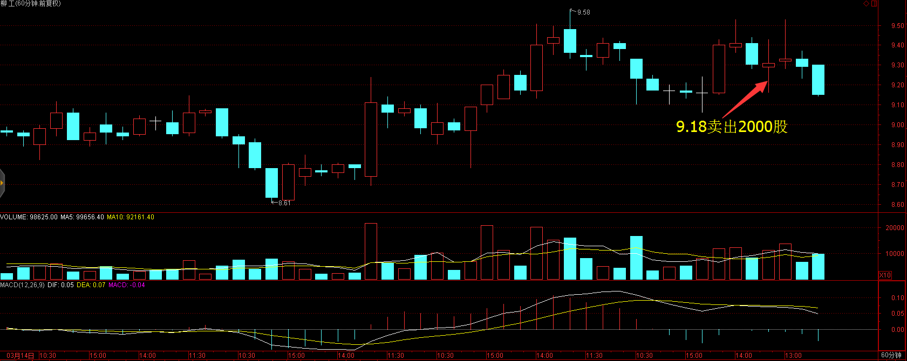

# 2017年3月30号交易计划 #
一、	大盘走势技术面分析：

- 创业板收盘已经跌破横盘超过3周的箱体，头部结构明显，短期继续调整概率较大。沪指收出了三只乌鸦K线形态，短期看空，明天关注3221点的支撑，跌破后可能会考验3200点的支撑。

二、	基本面分析：

1.	欧美股市多数收涨，纳指连涨4天，欧股收于近16月高位；金价跌0.2%，连跌两日；美国原油库存增幅低于预期，推动油价攀升创三周新高，美油涨2.36%，布油涨2.12%；美元指数继续反弹，非美货币下跌。

三、	仓位管理
仓位保持在50%左右。

四、	今天操作计划：

- 预计大盘会探底，反弹卖出股票，关注3212点的支撑，站稳买入股票，跌破3200点拉回来买入股票。

- 000528 柳工  冲高卖出。
- 600009 上海机场 冲高卖出
- 603669 灵康药业 持仓观望。
- 002398 建研集团 重点关注，找机会买入。
- 601100 恒立液压 重点关注。
- 002340 格林美 重点关注。
- 002300 太阳电缆 重点关注。
- 300099 尤洛卡 重点关注。
- 603227 雪峰科技 重点关注。

# 2017.03.30交易总结 #
一、	当天走势技术分析回顾

- 尾盘国债逆回购利率大幅跳水，意味着流动性最紧张时刻已经过去，大盘连续4天下跌，再连续杀跌的可能性比较少，重点关注明天盘中是否有放量下跌，杀出恐慌盘，然后拉回来，收出长下影线，短期可能会有反弹。

二、	交易明细

1.	买卖点截图

上海机场在30.22卖出500股。

柳工在9.18卖出2000股。

建研集团在15.44买入1500股。

2.	交易明细

三、	分析每笔交易心态、操作理由、可改进情况

交易总结：

- 今天早盘卖出了柳工和上海机场，买入了建研集团。

> 开盘后，大盘下跌，柳工比较弱，卖出了柳工。上海机场冲高的时候卖出。

> 午后大盘跌破3200点拉回来，买入了建研集团。建研集团放量突破了横盘超过9个月的箱体，由于大盘下跌，建研集团转跌，根据之前的总结，强势股由于大盘大跌而导致下跌，大盘站稳后，这些个股会强势反弹，这只股票尾盘补跌，可能是因为套牢住大量的筹码，这些筹码明天很可能抛盘，主力不想拉升去，反而打下来，明天可能还有低位接回来。

四、	收盘后账户截图

